

  

Analice el código y el comportamiento de una extensión maliciosa de Chrome para identificar los mecanismos de robo de datos, la exfiltración encubierta a través de etiquetas y las técnicas antianálisis.

**Categoría:**
* Análisis de malware

**Táctica:**
* Acceso de credenciales
* Colección
* Comando y Control
* Exfiltración

**Escenario:**
Su equipo de ciberseguridad ha sido alertado de actividades sospechosas en la red de su organización. Varios empleados informaron un comportamiento inusual en sus navegadores después de instalar lo que creían que era una extensión de navegador útil llamada "ChatGPT". 
Sin embargo, cosas extrañas comenzaron a suceder: las cuentas se estaban viendo comprometidas y la información confidencial parecía estar filtrando.

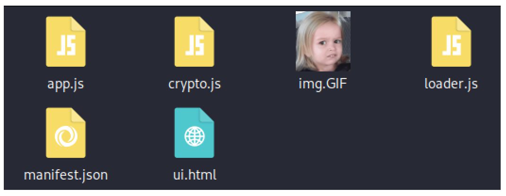

Su tarea es realizar un análisis exhaustivo de esta extensión para identificar sus componentes maliciosos.

## Pregunta 01

**¿Qué método de codificación utiliza la extensión del navegador para ocultar las URL de destino, lo que hace que sean más difíciles de detectar durante el análisis?**

Abrimos el código app.js y buscamos la función targets donde encontramos la URL ofuscada.

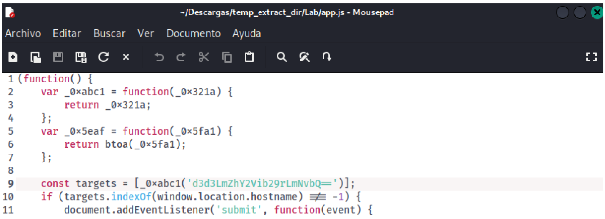

La analizamos en la herramienta CyberChef y encontramos el método de codificación de la URL.

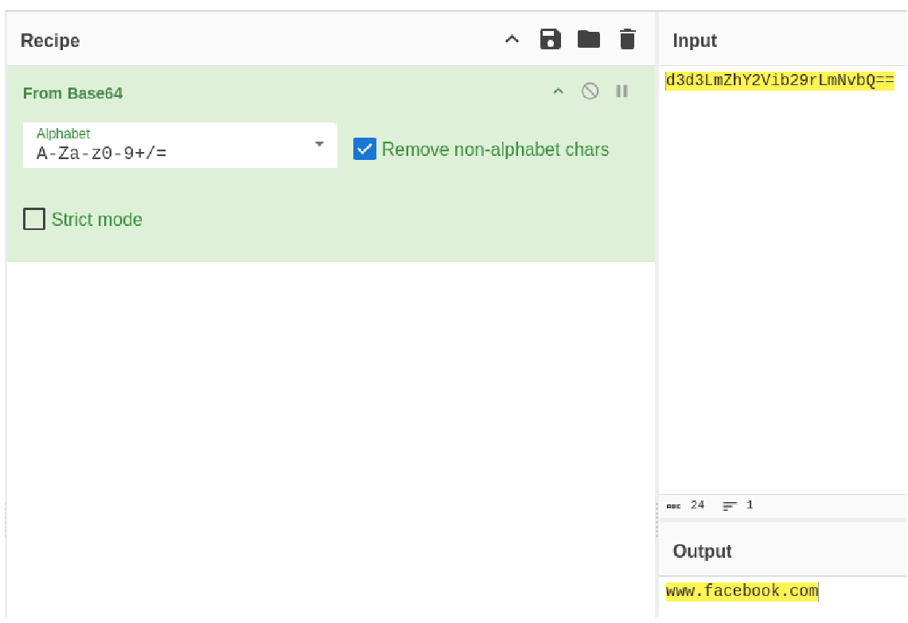

**Respuesta:** `Base64`

## Pregunta 02

**¿Qué sitio web supervisa la extensión para el robo de datos, apuntando a las cuentas de los usuarios para robar información confidencial?**

**Respuesta:** `www.facebook.com`

## Pregunta 03

**¿Qué tipo de elemento HTML es utilizado por la extensión para enviar datos robados?**

Busquemos la función que trate de enviar datos y encontramos lo siguiente:

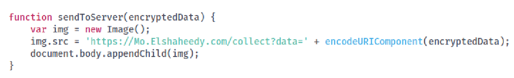

La función sendToServer() crea un objeto Image (new Image()), asigna al atributo src una URL que contiene los datos robados y lo agrega al DOM. Esto provoca que el navegador envíe una petición HTTP GET al servidor del atacante, utilizando el elemento HTML  para exfiltrar la información.

**Respuesta:** ``

## Pregunta 04

¿Cuál es la primera condición específica en el código que activa la extensión para
desactivarse?
Para esto analizamos el loader.js y buscamos una condición:

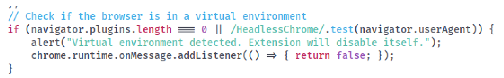

**Respuesta:** `navigator.plugins.length === 0`

## Pregunta 05
¿Qué evento captura la extensión para rastrear la entrada del usuario enviada a
través de formularios?
En app.js se identificó un EventListener asociado al evento submit mediante
document.addEventListener('submit', ...). Este evento se activa cuando el usuario envía
un formulario. La función obtiene el formulario desde event.target, extrae las
credenciales (username/email y password) utilizando FormData y las envía a
exfiltrateCredentials() para su posterior cifrado y exfiltración.

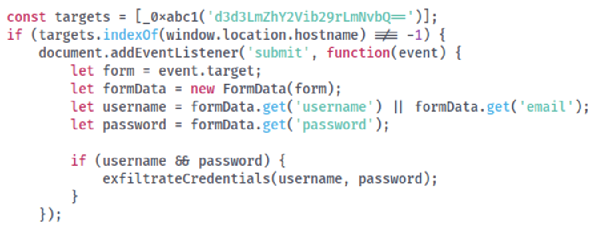

**Respuesta:** `submit`

## Pregunta 06
¿Qué API o método utiliza la extensión para capturar y monitorear las pulsaciones
de teclas de usuario?
En app.js se identificó que la extensión registra un listener mediante
document.addEventListener('keydown', ...). Este método de la API del DOM permite
monitorear todas las pulsaciones de teclas realizadas por el usuario. La tecla presionada
se obtiene a través de event.key y posteriormente se envía a la función exfiltrateData(),
donde es preparada para su cifrado y exfiltración.

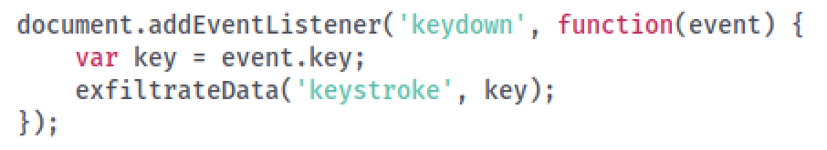

**Respuesta:** `keydown`

## Pregunta 07

¿Cuál es el dominio donde la extensión transmite los datos extraídos?
En la función sendToServer() se identificó que la extensión crea un objeto Image y asigna
al atributo src la URL https://Mo.Elshaheedy.com/collect?data=.... Al establecer este
atributo, el navegador realiza una petición HTTP GET hacia el dominio
Mo.Elshaheedy.com, al que se transmiten los datos extraídos como parámetro de la URL.

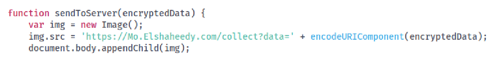

**Respuesta:** `Mo.Elshaheedy.com`

## Pregunta 08

¿Qué función del código se utiliza para filtrar las credenciales de usuario, incluido
el nombre de usuario y la contraseña?
Tras analizar el flujo del código, se identificó que el evento submit captura las
credenciales del formulario y las pasa a la función exfiltrateCredentials(). Esta función
construye un objeto con el nombre de usuario, la contraseña y el sitio de origen, cifra la
información mediante encryptPayload() y finalmente la envía al servidor remoto
utilizando sendToServer(). Por ello, exfiltrateCredentials() es la función utilizada para
exfiltrar las credenciales de usuario.

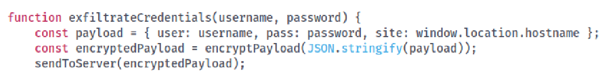

**Respuesta:** `exfiltrateCredentials(username, password);`

## Pregunta 09

¿Qué algoritmo de cifrado se aplica para proteger los datos antes de enviar?
Analizando el archivo crypto.js observamos que es AES.

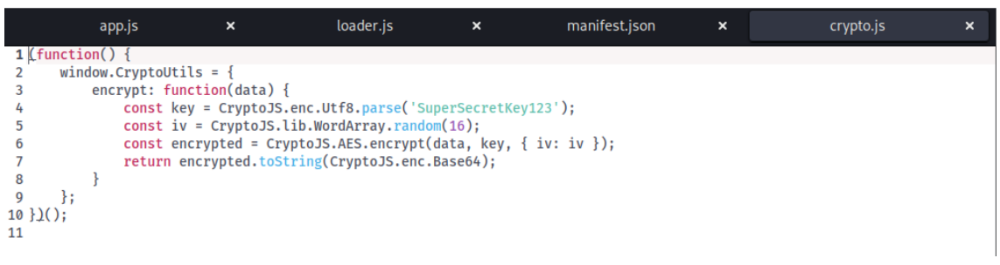

**Respuesta:** `AES`

## Pregunta 10

¿Qué tiene el acceso a la extensión para almacenar o manipular datos relacionados
con la sesión e información de autenticación?
Viendo los permisos vemos que tiene acceso a las cookies que es donde se guarda
información de una pagina en la que se entró.

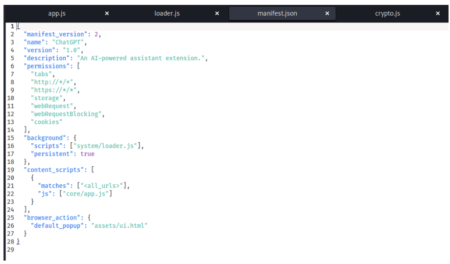

**Respuesta:** `cookies`

  

