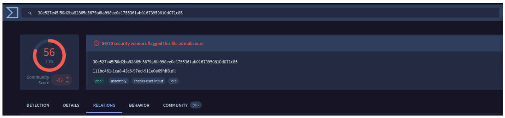
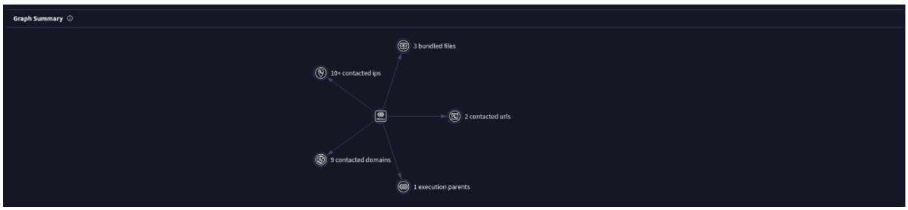
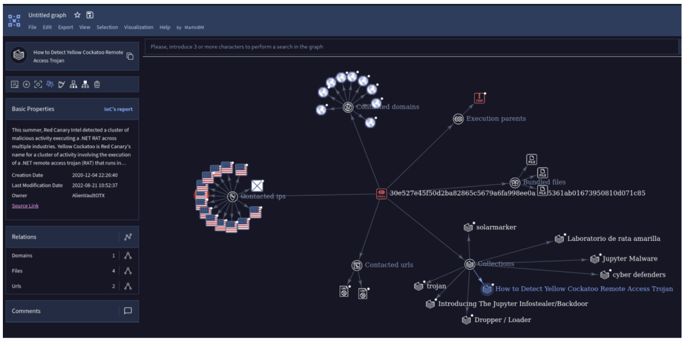
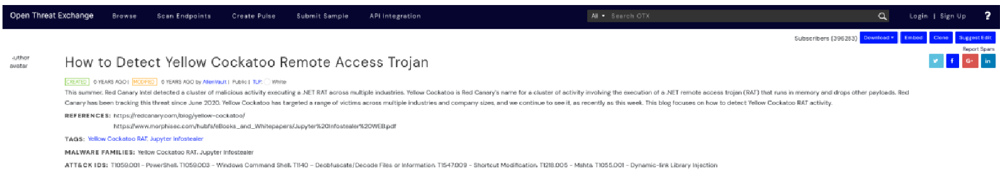
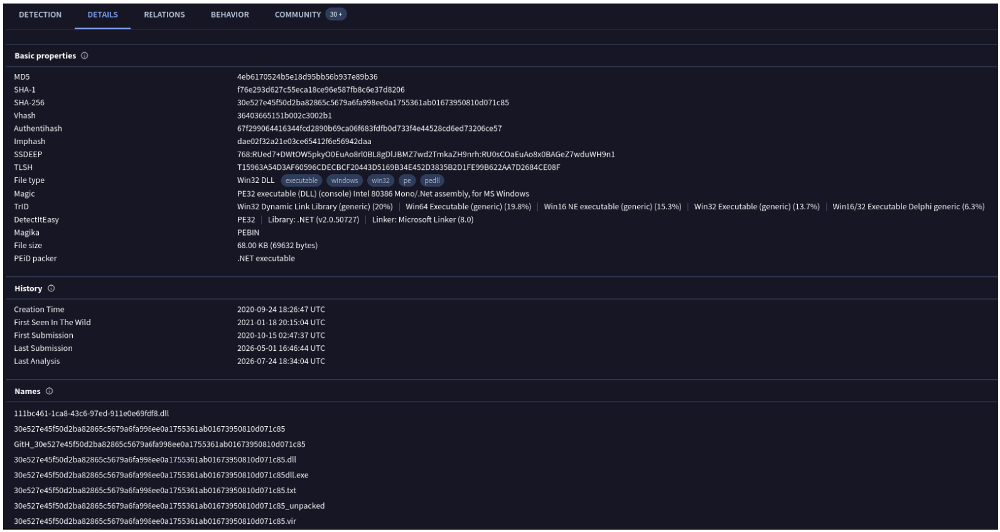
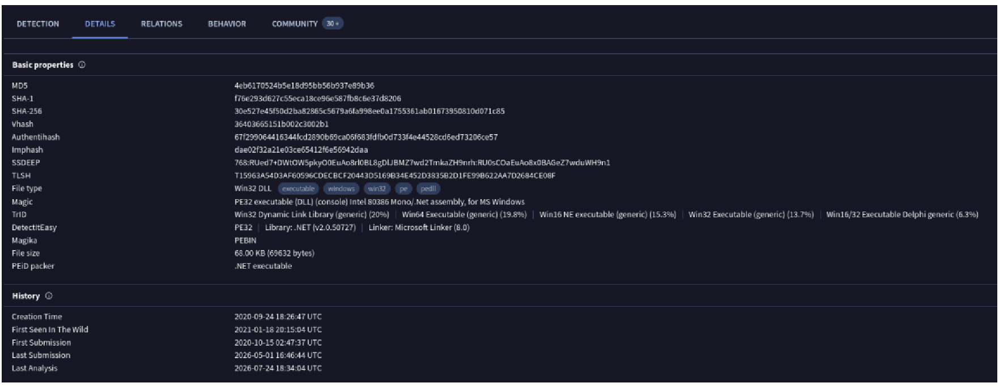
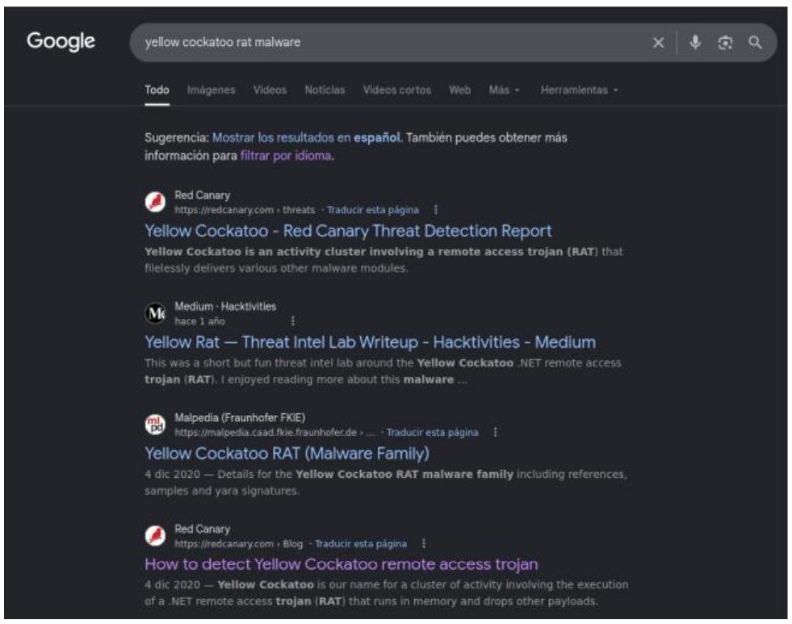
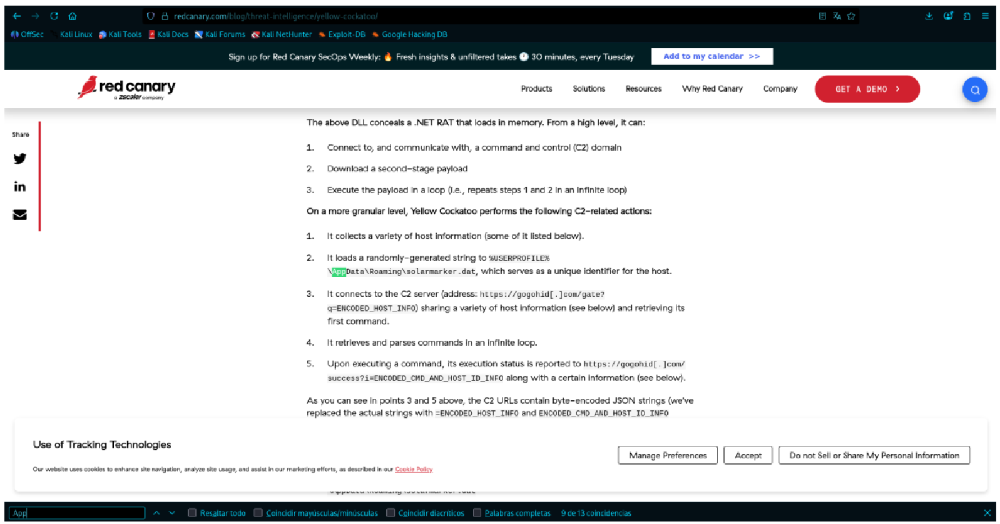
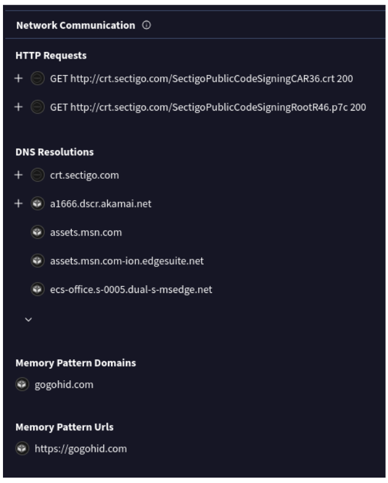

  

Analyze malware artifacts using threat intelligence platforms like VirusTotal to identify
IOCs, C2 servers, and understand adversary tactics.

**Category:**

* Threat Intel

**Tools:**

* VirusTotal
* Red Canary

**Scenario:**

Durante una verificación de seguridad de TI regular en GlobalTech Industries, se detectó
tráfico de red anormal desde múltiples estaciones de trabajo. Tras la investigación
inicial, se descubrió que las consultas de búsqueda de ciertos empleados estaban siendo
redirigidos a sitios web desconocidos. Este descubrimiento generó preocupaciones y
provocó una investigación más exhaustiva. Su tarea es investigar este incidente y
recopilar la mayor cantidad de información posible.

**Malware hash:**

`30E527E45F50D2BA82865C5679A6FA998EE0A1755361AB01673950810D071C85`

Use this hash on online threat intel platforms (e.g., VirusTotal, Hybrid Analysis) to
complete the lab analysis.

## Pregunta 01

**Entender al adversario ayuda a defenderse de los ataques. ¿Cuál es el nombre de la
familia de malware que causa el tráfico de red anormal?**

Subimos el hash a VirusTotal y vamos a la sección de “Relations”:

Navegamos hasta el fondo y vamos a “Graph Summary”:

Damos clic al icono central del grafo.

Las “Collections” son conjuntos de muestras analizadas por investigadores de VirusTotal
o de la comunidad. Si una muestra pertenece a una campaña o familia conocida,
normalmente la colección lo indica.
En la captura se ven varias colecciones relacionadas:

* solarmarker
* Introducing The Jupyter Infostealer/Backdoor
* Dropper / Loader
* How to Detect Yellow Cockatoo Remote Access Trojan
* Laboratorio de rata amarilla
* Jupyter Malware

La colección “How to Detect Yellow Cockatoo Remote Access Trojan” describe una
campaña del “Yellow Cockatoo RAT”. Al abrirla, el artículo menciona lo siguiente:

Nos dice exactamente a que familia pertenece.

**Respuesta:** `Yellow Cockatoo RAT`

## Pregunta 02

**Como parte de nuestra respuesta a incidentes, conocer los nombres de archivo
comunes que utiliza el malware puede ayudar a escanear otras estaciones de
trabajo en busca de una posible infección. ¿Cuál es el nombre de archivo común
asociado al malware descubierto en nuestras estaciones de trabajo?**

Para ver con que nombres se subió este archivo vamos a la sección de “Details” y vamos
hasta la parte de “Names”. El primer archivo DLL que aparece es el nombre de archivo
común utilizado por este malware.

**Respuesta:** `111bc461-1ca8-43c6-97ed-911e0e69fdf8.dll`

## Pregunta 03

**La determinación de la marca de tiempo de compilación del malware puede revelar
información sobre su línea de tiempo de desarrollo e implementación. ¿Cuál es la
marca de tiempo de compilación del malware que infectó nuestra red?**

En la misma sección “Details” en la parte de “History” encontraremos datos horarios
relevantes del archivo estudiado. Lo que nos importa es la de “Creation Time”.

**Respuesta:** `2020-09-24 18:26`

## Pregunta 04

**Entender cuándo la comunidad de ciberseguridad en general identificó por
primera vez que el malware podría ayudar a determinar cuánto tiempo podría
haber estado el malware en el entorno antes de la detección. ¿Cuándo se envió el
malware por primera vez a VirusTotal?**

Esta pregunta se resuelve con la captura anterior, solo que la fecha que nos importa es la
de “First Submission”.

**Respuesta:** `2020-10-15 02:47`

## Pregunta 05

**Para erradicar completamente la amenaza de los sistemas de Industries,
necesitamos identificar todos los componentes abandonados por el malware.
¿Cuál es el nombre del archivo .dat que el malware dejó caer en la carpeta
AppData?**

Buscamos en internet este caso y buscamos entre las páginas que nos salen para buscar
información.

Si entramos a la cuarta opción encontraremos la información que nos piden. Nos
ayudamos con Ctrl + F buscando con palabras de ayuda para tener una búsqueda mas
rápida.

**Respuesta:** `solarmarker.dat`

## Pregunta 06

**Es crucial identificar los servidores C2 con los que el malware se comunica para
bloquear su comunicación y evitar una mayor exfiltración de datos. ¿Qué es el
servidor C2 con el que se comunica el malware?**

Vamos a la sección de “Behavior” y vamos a la parte de “Network Communication”.

Aquí, encontrarás el Memory Pattern URLs. Lo que revela el servidor C2 con el que se
comunica el malware.

**Respuesta:** `https://gogohid.com`

  

