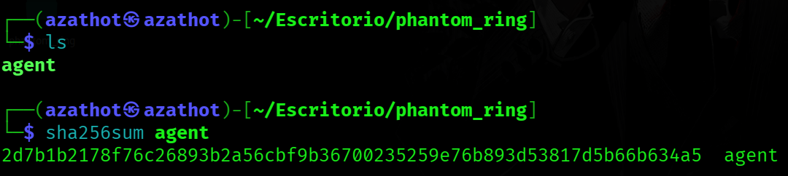
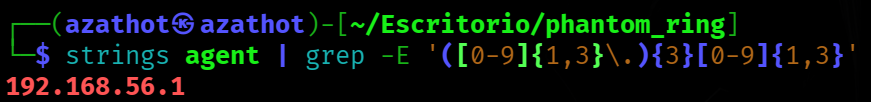

  

---

# Escenario del Sherlock

El equipo de SOC de tu organización interceptó un binario sospechoso durante una operación rutinaria de caza de amenazas en un servidor Linux. 
El archivo fue encontrado en /var/tmp con un nombre inusual y estaba intentando establecer conexiones salientes. El análisis inicial sugiere que podría ser un agente de post-explotación. 
Tu tarea es realizar un análisis estático del binario para identificar sus capacidades, extraer indicadores de compromiso y comprender la infraestructura del actor de amenazas.

---

# Preguntas

## Tarea 01

**¿Cuál es el hash SHA256 del binario malicioso?**

Se nos entrega una carpeta que contiene un archivo ejecutable llamado "agent".

**Respuesta:** `2d7b1b2178f76c26893b2a56cbf9b36700235259e76b893d53817d5b66b634a5`

## Tarea 02

**¿Cuál es la dirección IP hardcodeada en el binario para la comunicación C2?**

**Respuesta:** `192.168.56.1`

## Tarea 03

**¿A qué puerto se conecta el agente en el servidor C2?**

Los investigadores de LAC Watch observaron una campaña "RevivalStone" por el actor de amenaza altamente persistente (APT) Winnti en marzo de 2024. La campaña se dirige a organizaciones en los sectores de fabricación, materiales y energía japoneses.
Fuente: https://codebook.machinarecord.com/threatreport/silobreaker-weekly-cyber-digest/37443/

**Respuesta:** `RevivalStone`

## Tarea 04

**¿Cuántos segundos espera el agente antes de intentar reconectarse tras una conexión fallida?**

Una firma de seguridad japonesa también encontró referencias a TreadStone y StoneV5 en su campaña RevivalStone, y la primera fue un controlador diseñado para trabajar con el malware Winnti, que se vinculó a un panel de control de malware Linux de I-Soon.
Fuente: https://wins21.com/kor/promotion/information.html?bmain=view&uid=5318&search=%26page%3D45

**Respuesta:** `I-Soon`

## Tarea 05

**¿Cuántos comandos diferentes soporta el agente? (excluyendo comandos inválidos)**

El nombre aparece en el título de la ventana del controlador de malware Linux en la filtración de i-Soon.
Fuente: https://www.lac.co.jp/lacwatch/report/20250213_004283.html

**Respuesta:** `TreadStone`

## Tarea 06

**¿Qué interfaz del kernel de Linux abusa este malware para evadir el monitoreo de syscalls del EDR?**

Encontramos esta información en la figura anterior.

**Respuesta:** `Winnti v5.0`

## Tarea 07

**¿Qué archivo lee el agente para enumerar los usuarios conectados?**

Fuente: https://www.lac.co.jp/lacwatch/report/20250213_004283.html

**Respuesta:** `SQL injection`

## Tarea 08

**¿Qué directorio escanea el agente cuando busca binarios SUID para escalada de privilegios?**

Fuente: https://www.lac.co.jp/lacwatch/report/20250213_004283.html

**Respuesta:** `sqlmap file uploader`

## Tarea 09 

**¿Qué cadena busca el agente en /proc/[pid]/maps para identificar herramientas de seguridad que usan eBPF?**

**Respuesta:** `rebeyond`

## Tarea 10

**¿Cuál es la ruta completa del primer archivo de tracing que el agente intenta deshabilitar?**

Fuente: https://thehackernews.com/2025/02/winnti-apt41-targets-japanese-firms-in.html

**Respuesta:** `CUNNINGPIGEON`

## Tarea 11

**¿Qué ruta de procfs lee el agente para encontrar la ubicación de su propio ejecutable antes de la autodestrucción?**

Fuente: https://www.lac.co.jp/lacwatch/report/20250213_004283.html

**Respuesta:** `PRIVATELOG_WINNKIT`

## Tarea 12

**¿Qué cadena de comando compara el agente para activar la eliminación de su propio binario?**

Fuente: https://www.lac.co.jp/lacwatch/report/20250213_004283.html

**Respuesta:** `SessionEnv`
