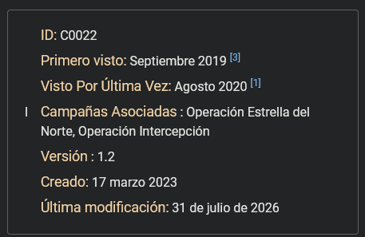
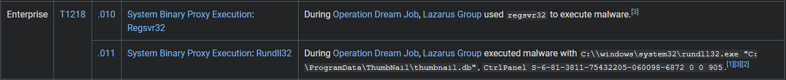
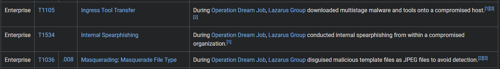
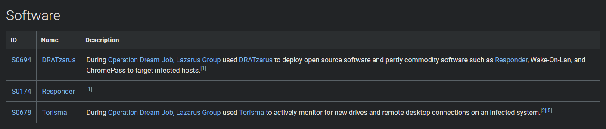
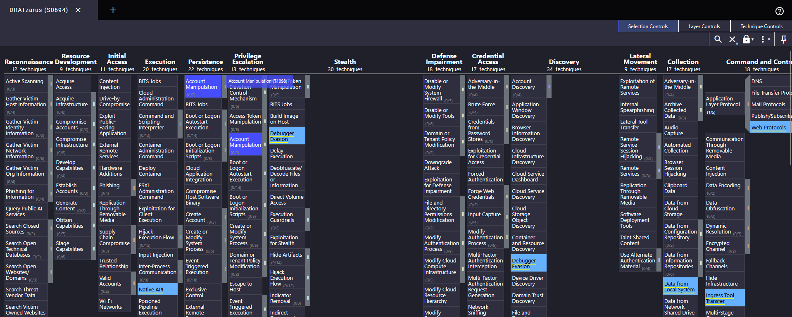
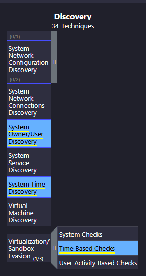
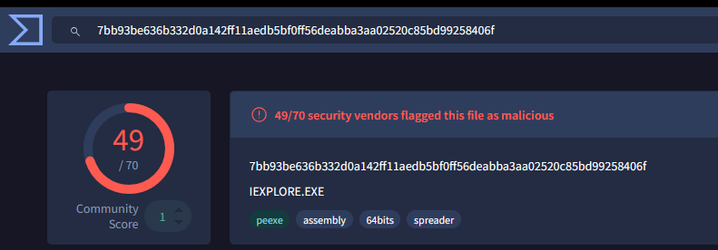
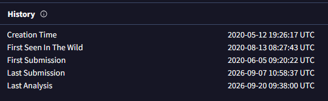
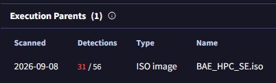
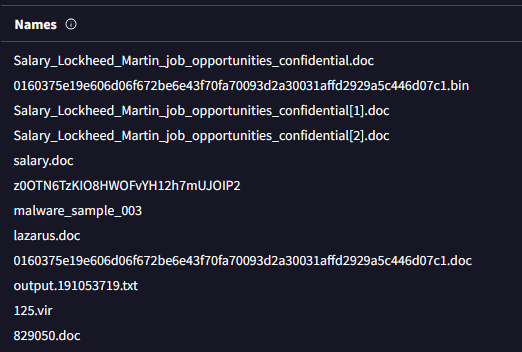

  

---

# Acerca de
En este Sherlock, los jugadores serán introducidos al framework MITRE ATT&CK, que es una herramienta integral utilizada para investigar y comprender grupos de amenazas persistentes avanzadas (APT). 
Específicamente, los jugadores se enfocarán en el grupo APT conocido como Lazarus Group. A medida que avancen, los jugadores podrán explorar diversas tácticas, técnicas y procedimientos (TTPs) asociados con Lazarus Group.
* Very Easy

---

# Escenario del Sherlock
Eres un analista junior de inteligencia de amenazas en una empresa de Ciberseguridad. Se te ha asignado la tarea de investigar una campaña de ciberespionaje conocida como Operation Dream Job. El objetivo es recopilar información crucial sobre esta operación.

---

# Preguntas

## Tarea 01

**¿Quién llevó a cabo la Operation Dream Job?**

Buscamos en Mitre Att&ck información de esta operación.

**Respuesta:** `Lazarus Group`

## Tarea 02

**¿Cuándo se observó por primera vez esta operación?**

**Respuesta:** `September 2019`

## Tarea 03

**Hay 2 campañas asociadas con la Operation Dream Job. Una es Operation North Star, ¿cuál es la otra?**

**Respuesta:** `Operation Interception`

## Tarea 04

**Durante la Operation Dream Job, había dos binarios del sistema utilizados para la ejecución por proxy. Uno era Regsvr32, ¿cuál era el otro?**

**Respuesta:** `Rundll32`

## Tarea 05

**¿Qué técnica de movimiento lateral utilizó el adversario?**

**Respuesta:** `Internal Spearphishing`

## Tarea 06

**¿Cuál es el ID de técnica para la respuesta anterior?**

**Respuesta:** `T1534`

## Tarea 07

**¿Qué Remote Access Trojan utilizó el Lazarus Group en la Operation Dream Job?**

**Respuesta:** `DRATzarus`

## Tarea 08

**¿Qué técnica utilizó el malware para la ejecución?**

**Respuesta:** `Native API`

## Tarea 09

**¿Qué técnica utilizó el malware para evitar la detección en un sandbox?**

**Respuesta:** `Time Based Checks`

## Tarea 10

**Para responder las preguntas restantes, utiliza VirusTotal y consulta el archivo IOCs.txt. ¿Cuál es el nombre asociado con el primer hash proporcionado en el archivo IOC?**

**Respuesta:** `IEXPLORE.EXE`

## Tarea 11

**¿Cuándo se creó por primera vez el archivo asociado con el segundo hash en el IOC?**

**Respuesta:** `2020-05-12 19:26:17`

## Tarea 12

**¿Cuál es el nombre del archivo de ejecución padre asociado con el segundo hash en el IOC?**

**Respuesta:** `BAE_HPC_SE.iso`

## Tarea 13

**Examina el tercer hash proporcionado. ¿Cuál es el nombre de archivo probablemente utilizado en la campaña que se alinea con las tácticas conocidas del adversario?**

**Respuesta:** `Salary_Lockheed_Martin_job_opportunities_confidential.doc`

## Tarea 14

**¿Cuál URL maliciosa en las URLs contactadas se utiliza para obtener un archivo .docx secundario?**

**Respuesta:** `https://markettrendingcenter.com/lk_job_oppor.docx`
