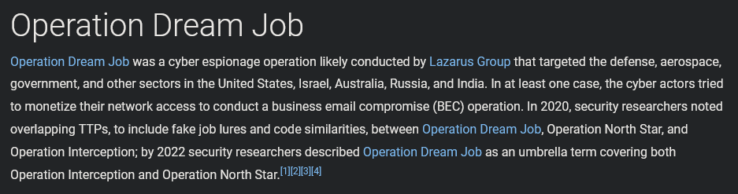
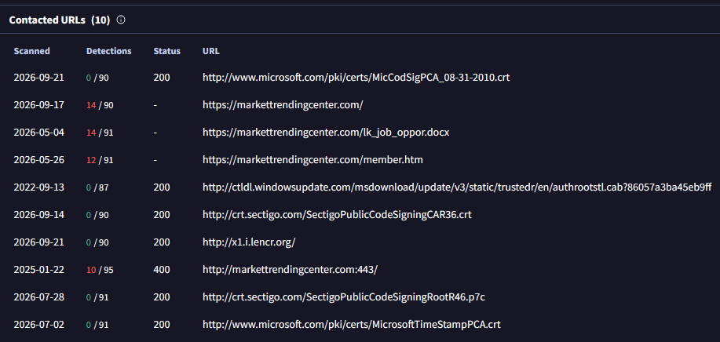
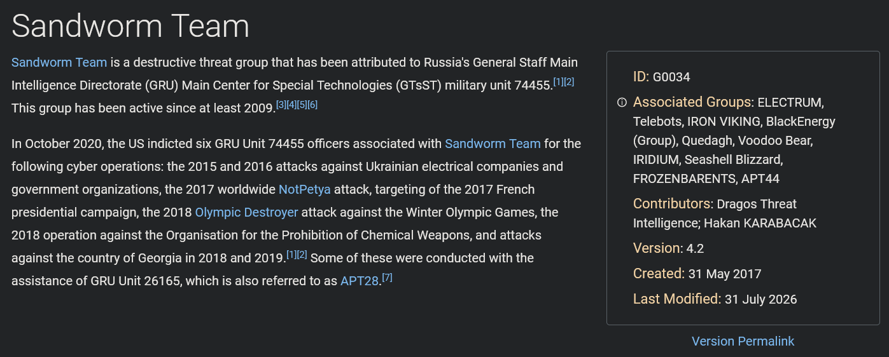
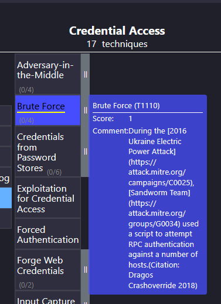

  

---

# Acerca de
En este Sherlock, los jugadores serán introducidos al framework MITRE ATT&CK, que es una herramienta integral utilizada para investigar y comprender grupos de amenazas persistentes avanzadas (APT). 
Específicamente, los jugadores se enfocarán en el grupo APT conocido como Lazarus Group. A medida que avancen, los jugadores podrán explorar diversas tácticas, técnicas y procedimientos (TTPs) asociados con Lazarus Group.
* Very Easy

---

# Escenario del Sherlock
Eres un analista junior de inteligencia de amenazas en una empresa de Ciberseguridad. Se te ha asignado la tarea de investigar una campaña de ciberespionaje conocida como Operation Dream Job. El objetivo es recopilar información crucial sobre esta operación.

---

# Preguntas

## Tarea 01

**¿Quién llevó a cabo la Operation Dream Job?**

**Respuesta:** `Lazarus Group`

## Tarea 02

**¿Qué puerto usa SMB para operar?**

**Respuesta:** `445`

## Tarea 03

**¿Cuál es el nombre del servicio para el puerto 445 que apareció en nuestro escaneo de Nmap?**

**Respuesta:** `microsoft-ds`

## Tarea 04

**¿Cuál es la 'flag' o 'switch' que podemos usar con la utilidad smbclient para 'listar' los recursos compartidos SMB disponibles en Dancing?**

**Respuesta:** `-L`

## Tarea 05

**¿Cuántos recursos compartidos hay en Dancing?**

**Respuesta:** `4`

## Tarea 06

**¿Cuál es el nombre del recurso compartido al que finalmente podemos acceder con una contraseña en blanco?**

**Respuesta:** `WorkShares`

## Tarea 07

**¿Cuál es el comando que podemos usar dentro del shell de SMB para descargar los archivos que encontramos?**

**Respuesta:** `get`

## Envía la flag ubicada en el recurso compartido SMB

**Respuesta:** `5f61c10dffbc77a704d76016a22f1664`
