

  

---

# Escenario del Sherlock
Eres un Analista de Inteligencia de Amenazas con una nueva asignación: lo único que sabes es que Winnti está detrás de este desastre. Tu organización ha detectado actividad sospechosa dirigida a empresas de manufactura y energía, y el SOC necesita respuestas rápidamente.

---

# Preguntas

## Tarea 01

**¿Cuál es el número de designación APT principal utilizado para rastrear a este actor de amenazas patrocinado por el estado que ha estado activo desde al menos 2012?**

Según MITRE ATT&CK. APT41 se superpone al menos parcialmente con informes públicos sobre grupos que incluyen BARIUM y Winnti Group.

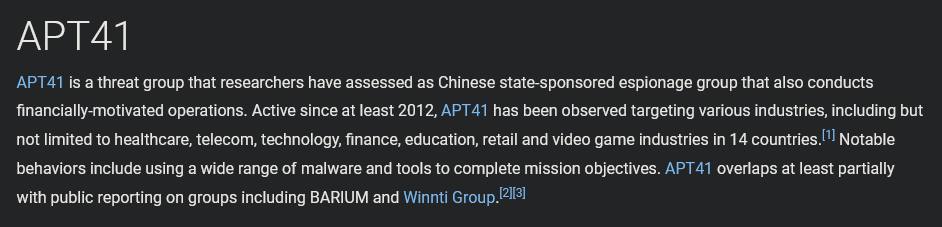

**Respuesta:** `APT41`

## Tarea 02

**Este grupo es rastreado bajo múltiples nombres por diferentes proveedores de seguridad. Proporciona el nombre alternativo utilizado por Symantec.**

El grupo Winnti, rastreado como Blackfly y Suckfly por Symantec. 
Fuente: https://www.cybersecurity-help.cz/blog/726.html

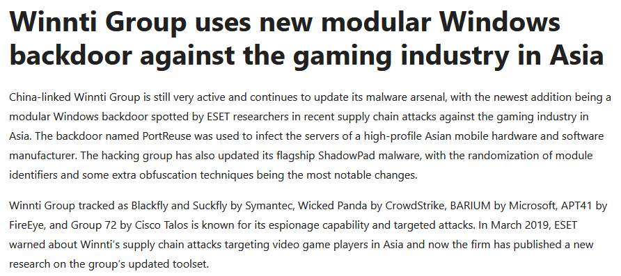

**Respuesta:** `Blackfly`

## Tarea 03

**¿Cuál es el nombre de la campaña que se dirigió específicamente a organizaciones en los sectores de manufactura, materiales y energía?**

Los investigadores de LAC Watch observaron una campaña "RevivalStone" por el actor de amenaza altamente persistente (APT) Winnti en marzo de 2024. La campaña se dirige a organizaciones en los sectores de fabricación, materiales y energía japoneses.
Fuente: https://codebook.machinarecord.com/threatreport/silobreaker-weekly-cyber-digest/37443/

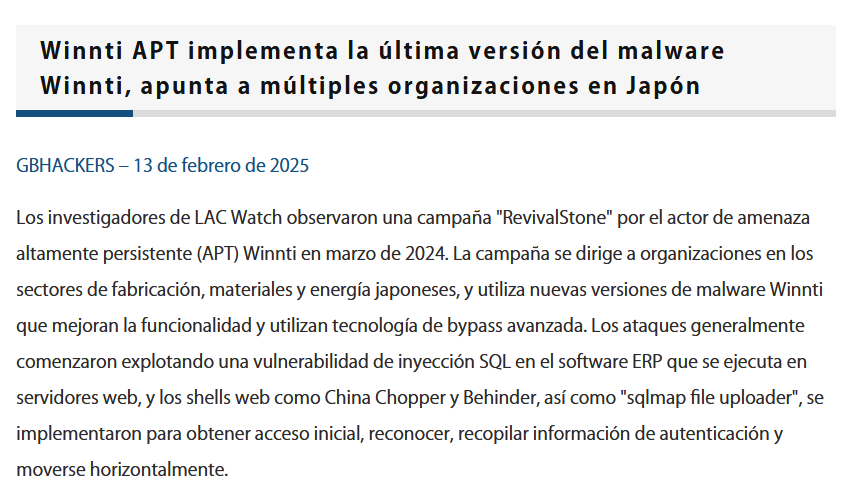

**Respuesta:** `RevivalStone`

## Tarea 04

**Se filtraron documentos internos de un contratista de seguridad, revelando un controlador Linux para el malware. ¿Cuál es el nombre común de esta filtración?**

Una firma de seguridad japonesa también encontró referencias a TreadStone y StoneV5 en su campaña RevivalStone, y la primera fue un controlador diseñado para trabajar con el malware Winnti, que se vinculó a un panel de control de malware Linux de I-Soon.
Fuente: https://wins21.com/kor/promotion/information.html?bmain=view&uid=5318&search=%26page%3D45

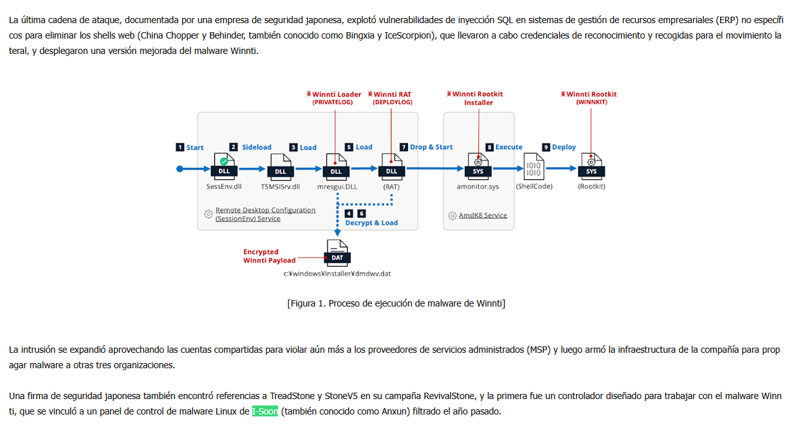

**Respuesta:** `I-Soon`

## Tarea 05

**Los investigadores descubrieron referencias a un componente de infraestructura de comando y control basado en Linux con un nombre clave de temática geológica. ¿Cuál es el nombre de este panel de control diseñado específicamente para gestionar el ecosistema de malware?**

El nombre aparece en el título de la ventana del controlador de malware Linux en la filtración de i-Soon.
Fuente: https://www.lac.co.jp/lacwatch/report/20250213_004283.html

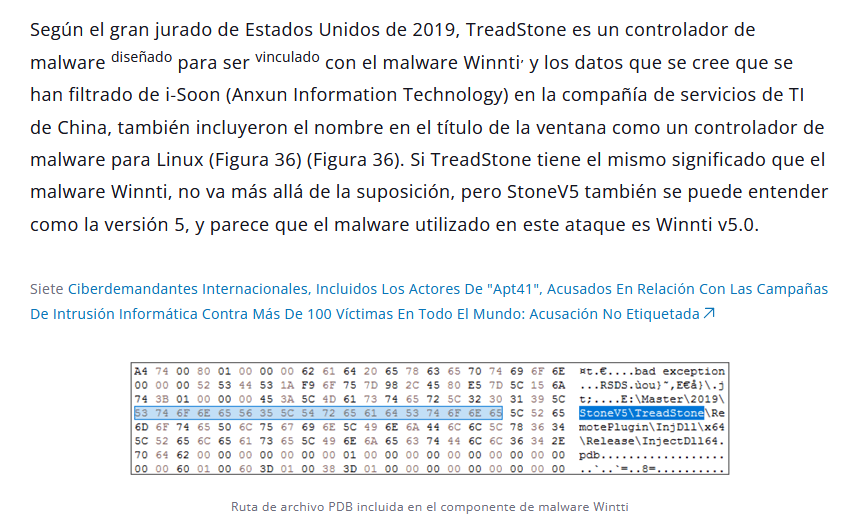

**Respuesta:** `TreadStone`

## Tarea 06

**¿Qué designación de versión se encontró en las muestras que indica la iteración más reciente de este malware?**

Encontramos esta información en la figura anterior.

**Respuesta:** `Winnti v5.0`

## Tarea 07

**¿Qué tipo de vulnerabilidad se explotó en el sistema para obtener acceso inicial durante la campaña de la tarea 3?**

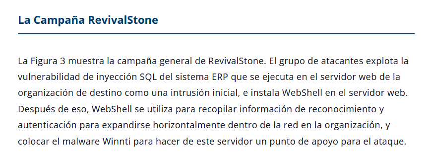

Fuente: https://www.lac.co.jp/lacwatch/report/20250213_004283.html

**Respuesta:** `SQL injection`

## Tarea 08

**Los adversarios desplegaron múltiples web shells incluyendo "China Chopper" y "Behinder". ¿Cuál es el nombre del tercer web shell mencionado?**

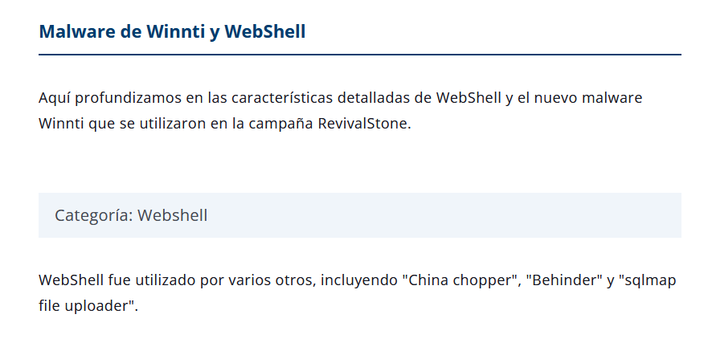

Fuente: https://www.lac.co.jp/lacwatch/report/20250213_004283.html

**Respuesta:** `sqlmap file uploader`

## Tarea 09 

**Behinder (también llamado Bingxia) utiliza una clave de cifrado hardcodeada que consiste en los primeros 16 caracteres del hash MD5 de ¿qué palabra específica?**

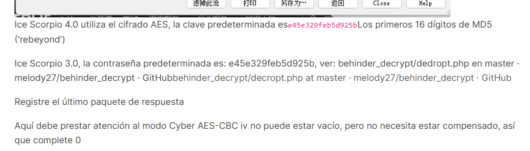

**Respuesta:** `rebeyond`

## Tarea 10

**¿Qué malware utiliza Microsoft Graph API para obtener comandos de mensajes de correo electrónico para gestión de archivos y operaciones de proxy?**

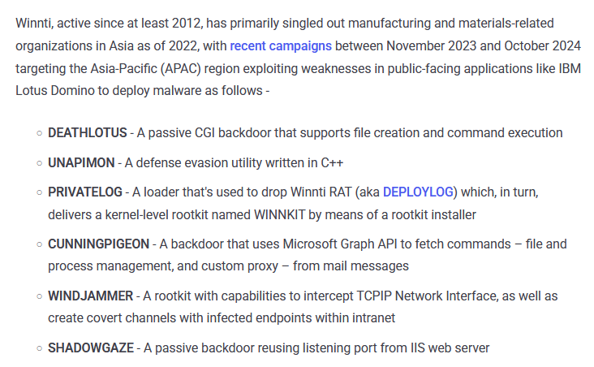

Fuente: https://thehackernews.com/2025/02/winnti-apt41-targets-japanese-firms-in.html

**Respuesta:** `CUNNINGPIGEON`

## Tarea 11

**En la campaña mencionada anteriormente, un componente loader deja caer un Remote Access Trojan (RAT), que luego instala un rootkit de nivel kernel. Identifica tanto el LOADER como el rootkit.**

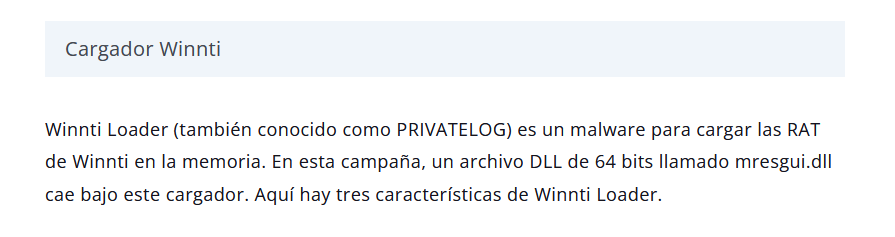

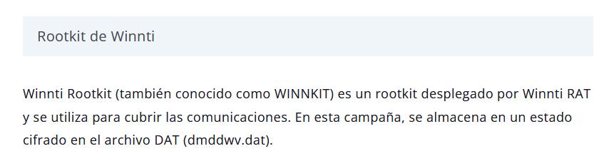

Fuente: https://www.lac.co.jp/lacwatch/report/20250213_004283.html

**Respuesta:** `PRIVATELOG_WINNKIT`

## Tarea 12

**¿Qué servicio de sistema de Windows se abusa comúnmente para DLL side-loading en esta campaña usando TSMSISrv.DLL?**

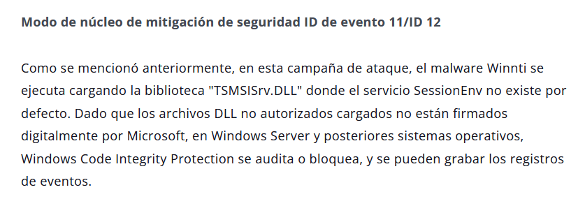

Fuente: https://www.lac.co.jp/lacwatch/report/20250213_004283.html

**Respuesta:** `SessionEnv`

## Tarea 13

**¿Qué modo de cifrado AES se utiliza en el proceso de descifrado del archivo DAT del malware?**

**Respuesta:** `Output Feedback`

## Tarea 14

**Dos muestras del archivo DLL prntvpt.dll de la campaña muestran timestamps de compilación del 12 de mayo de 2021 y del 17 de agosto de 2021. Identifica la campaña APT principal que estuvo activa durante este marco temporal exacto en 2021.**

**Respuesta:** `Operation CuckooBees`

## Tarea 15

**La regla YARA Winnti_Rootkit desarrollada por LAC Co., Ltd. contiene algunas cadenas de detección. Dos de estas cadenas hacen referencia a objetos de dispositivo del kernel de Windows usando formatos de ruta específicos. Identifica la ruta del objeto de dispositivo de Windows relacionada con la función Sound a nivel de hardware con la que interactúa el rootkit.**

**Respuesta:** `\\Device\\Beep`
