

  

---

# Acerca de
Este Sherlock trata sobre investigar la historia y las capacidades del Sandworm Team usando datos de la página de Mitre ATT&CK del grupo.
* Very Easy

---

# Escenario del Sherlock
Estando en la Industria ICS, tu equipo de seguridad siempre necesita estar actualizado y debe conocer las amenazas dirigidas a organizaciones de tu industria. Acabas de comenzar como pasante de Inteligencia de Amenazas, con un poco de experiencia en SOC. 
Tu gerente te ha dado una tarea para poner a prueba tus habilidades en investigación y qué tan bien puedes utilizar Mitre ATT&CK a tu favor.
Investiga sobre Sandworm Team, también conocido como BlackEnergy Group y APT44. Utiliza Mitre ATT&CK para entender cómo mapear el comportamiento y las tácticas del adversario en forma accionable.
Supera la evaluación e impresiona a tu gerente, ya que la inteligencia de amenazas es tu pasión.

---

# Preguntas

## Tarea 01

**Según las fuentes citadas por Mitre, ¿en qué año comenzó operaciones el Sandworm Team?**

Buscamos en Mitre Att&ck información de este equipo.

**Respuesta:** `2009`

## Tarea 02

**Mitre señala dos técnicas de acceso a credenciales utilizadas por el grupo BlackEnergy para acceder a varios hosts en la red comprometida durante una campaña de 2016 contra la red eléctrica ucraniana. Una es el acceso a memoria LSASS (T1003.001). ¿Cuál es el Attack ID de la otra?**

Vemos que la otra tecnica es la fuerza bruta.

**Respuesta:** `T1110`

## Tarea 03

**Durante la campaña de 2016, se observó al adversario utilizando un script VBS durante sus operaciones. ¿Cuál es el nombre del archivo VBS?**

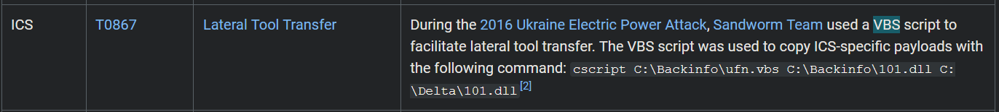

**Respuesta:** `ufn.vbs`

## Tarea 04

**El APT llevó a cabo una campaña importante en 2022. Se abusó de la aplicación de servidor para mantener la persistencia. ¿Cuál es el ID de Mitre Att&ck para la técnica de persistencia utilizada por el grupo para permitirles acceso remoto?**

En la parte de Persistencia vemos que se conectaron a una web shell.

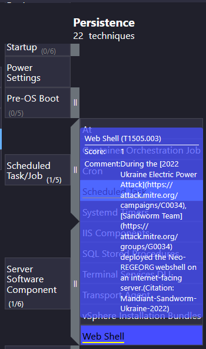

**Respuesta:** `T1505.003`

## Tarea 05

**¿Cuál es el nombre del malware / herramienta utilizada en la pregunta 4?**

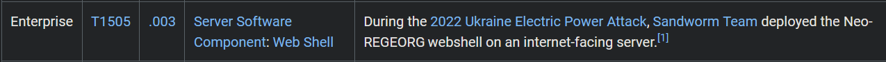

**Respuesta:** `Neo-REGEORG`

## Tarea 06

**¿Qué binario de aplicación SCADA fue abusado por el grupo para lograr la ejecución de código en Sistemas SCADA en la misma campaña de 2022?**

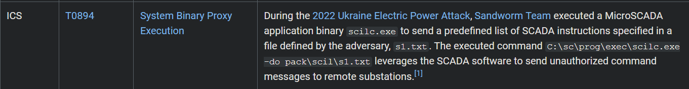

**Respuesta:** `scilc.exe`

## Tarea 07

**Identifica la línea de comandos completa asociada con la ejecución de la herramienta de la pregunta 6 para realizar acciones contra subestaciones en el entorno SCADA.**

Se lo puede ver en la imagen anterior.

**Respuesta:** `C:\sc\prog\exec\scilc.exe -do pack\scil\s1.txt`

## Tarea 08

**¿Qué malware/herramienta se utilizó para llevar a cabo la destrucción de datos en un entorno comprometido durante la misma campaña?**

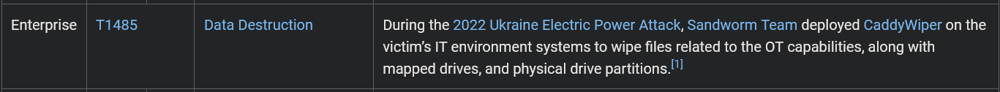

**Respuesta:** `CaddyWiper`

## Tarea 09 

**El malware/herramienta identificado en la pregunta 8 también tenía capacidades adicionales. ¿Cuál es el ID de Mitre Att&ck de la técnica específica que podía realizar en la táctica de Execution?**

Los adversarios pueden abusar de estas funciones de la API del sistema operativo como un medio para ejecutar comportamientos. 
De manera similar a Command and Scripting Interpreter, la API nativa y su jerarquía de interfaces proporcionan mecanismos para interactuar y utilizar diversos componentes de un sistema víctima.

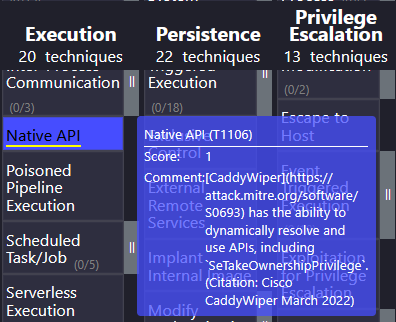

**Respuesta:** `T1106`

## Tarea 10

**El Sandworm Team es conocido por usar diferentes herramientas en sus campañas. Están asociados con un malware de auto-propagación que actuaba como ransomware mientras tenía características similares a un gusano. ¿Cuál es el nombre de este malware?**

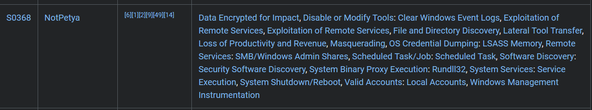

**Respuesta:** `NotPetya`

## Tarea 11

**¿Cuál fue el ID del boletín de seguridad de Microsoft para la vulnerabilidad que el malware de la pregunta 10 utilizó para propagarse por todo el mundo?**

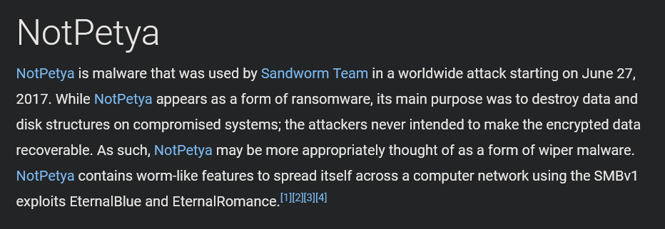

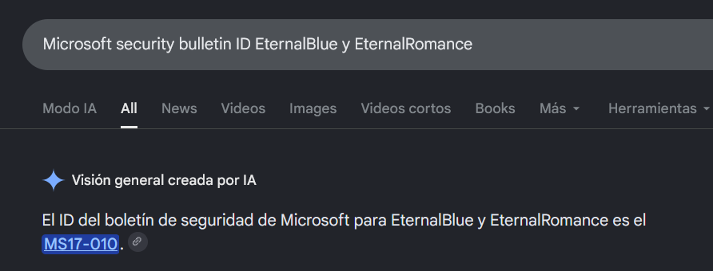

**Respuesta:** `MS17-010`

## Tarea 12

**¿Cuál es el nombre del malware/herramienta utilizado por el grupo para atacar módems?**

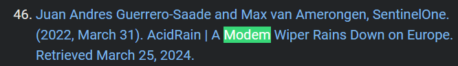

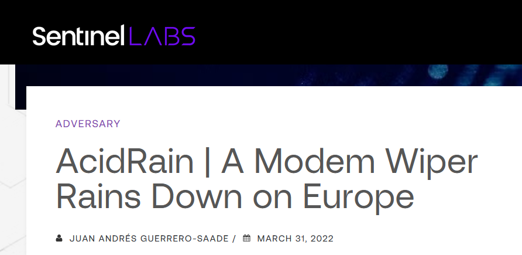

**Respuesta:** `AcidRain`

## Tarea 13

**Los Threat Actors también usan puertos no estándar en su infraestructura con fines de Seguridad Operacional. ¿En qué puerto se informó que el equipo Sandworm estableció su servidor SSH para escuchar?**

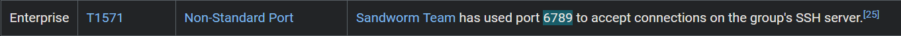

**Respuesta:** `6789`

## Tarea 14

**El Sandworm Team ha sido asistido por otro grupo APT en diversas operaciones. ¿Qué grupo específico se sabe que ha colaborado con ellos?**

En la descripción podemos ver que grupo lo ayudo.

**Respuesta:** `APT28`
